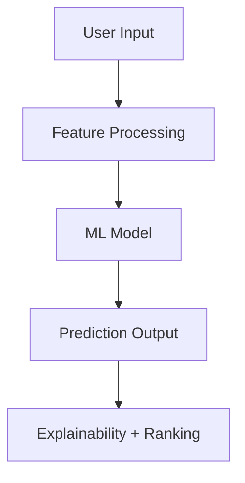

# 🚀 ResistAI – Predict Antibiotic Resistance in Seconds

> Stop guessing. Start predicting.

---

## 🧠 Overview

**ResistAI** is an AI-powered clinical decision support system that predicts **antibiotic resistance** in real-time using machine learning.

Antimicrobial resistance (AMR) is a global health crisis, causing treatment delays and increasing mortality due to slow lab results.

ResistAI bridges this gap by providing **instant predictions (<2s)** based on patient, bacterial, and clinical data.

---

## ⚡ Key Features

* 🧬 **Species-aware prediction** (E. coli, S. aureus, etc.)
* 💊 **Target antibiotic resistance prediction**
* 📊 **Probability-based output (risk scoring)**
* 🧠 **Explainable AI (XAI)** – shows why prediction was made
* 📈 **Antibiotic ranking system** (best → worst)
* 🏥 **Clinical context inputs**:

  * Patient age
  * Hospital ward (ICU / OPD)
  * Infection source
  * Prior antibiotic exposure
* ⚡ **Real-time prediction (<2 seconds)**

---

## 🌍 The Problem

Antimicrobial Resistance (AMR) is one of the biggest global health threats:

⏳ Lab testing takes 48–72 hours

❌ Wrong antibiotics → treatment failure

⚠️ Rising drug-resistant infections worldwide

👉 Doctors often make critical decisions without real-time insights

---


## 🧠 How It Works



---

## 📊 Example Output

```text
Bacteria: E. coli
Antibiotic: Ciprofloxacin

Resistance: HIGH 🔴
Probability: 82%

Reason:
- Prior antibiotic exposure
- ICU admission
- Urinary infection
```

---

## 🏗️ Tech Stack

### 🔹 Frontend

* React.js / Next.js
* Tailwind CSS
* Framer Motion

### 🔹 Backend

* FastAPI (Python)

### 🔹 Machine Learning

* Scikit-learn
* Random Forest / Logistic Regression
* SHAP (Explainability)

---

## 📂 Project Structure

```bash
ResistAI/
│
├── backend/                     # FastAPI backend
│   ├── app.py                  # Main API file
│   ├── train_model.py          # Model training script
│   ├── test_predict.py         # Model testing script
│   ├── resistance_model.pkl    # Trained ML model
│   ├── dataset1.csv            # Training dataset
│   ├── dataset2.csv            # Additional dataset
│   └── __pycache__/            # Python cache files
│
├── frontend/                   # Frontend UI
│   ├── index.html              # Main UI page
│   ├── styles.css              # Styling
│   ├── script.js               # Frontend logic
│   └── package-lock.json       # Dependencies lock file
│
├── .venv/                      # Virtual environment 
├── LICENSE                     # License file
├── README.md                   # Project documentation
```


---

## 🧪 Model Details

The model is trained on clinical-like features such as:

* Bacterial species
* Patient demographics
* Infection type
* Antibiotic exposure history

---

## 📊 Dataset

The model is trained on structured clinical-like data including:

* Bacterial species
* Patient age
* Hospital ward
* Infection source
* Prior antibiotic exposure
* Target antibiotic
* Resistance outcome (0 = Sensitive, 1 = Resistant)

### 🔍 Sample Data

| Species       | Age | Ward | Infection | Antibiotic    | Resistant |
| ------------- | --- | ---- | --------- | ------------- | --------- |
| E. coli       | 45  | ICU  | Urine     | Ciprofloxacin | 1         |
| S. aureus     | 30  | OPD  | Skin      | Vancomycin    | 0         |
| K. pneumoniae | 60  | ICU  | Blood     | Meropenem     | 1         |

> Dataset used for training is available in the repository (`dataset1.csv`, `dataset2.csv`)


## 📸 Screenshots

### 🏠 Home Page


### 📊 Dashboard


### 📸 Dataset Preview


---

## 🌐 Live Demo

🚀 Frontend (Vercel): https://resistai.vercel.app/  

⚙️ Backend (Render): https://resistai.onrender.com/  
**⚠ Note: Backend is hosted on free tier (Render), may take a few seconds to wake up.**

---

## ⚠️ Disclaimer

This project is for **educational and research purposes only**
Not intended for real clinical use

---

## 💡 Future Improvements

* 🔬 Real hospital dataset integration
* 📱 Mobile app version
* 🤖 Deep learning models
* 🧠 LLM-based assistant
* 🔗 EHR integration

---

## 🤝 Contributing

Contributions are welcome!
Feel free to fork and submit pull requests.

---

## 👨‍💻 Author

**Ankit singh Yadav**  

**Github-https://github.com/ankitsingyadav**

---

## ⭐ Show Your Support

If you like this project:

👉 Star ⭐ the repo
👉 Share it

---
